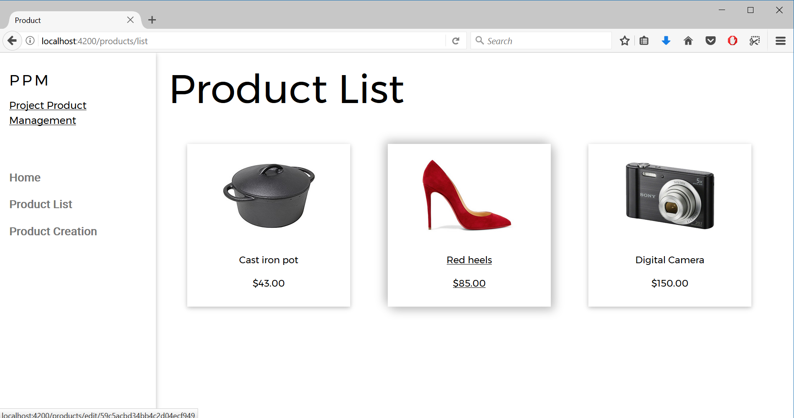

# Online Store

This assignment was to create a front-end for an online store, with full CRUD ability to (create, retrieve, update, destroy).

It has the following dependencies:

* task-api -- creates a local api to allow our app to interact with a database.
  * Please follow the installation instructions on its readme (one directory up)
  * MongoDB: You must have a local mongo server running, or modify the api code to connect to a remote one.
  * nodejs: to serve the api
* Angular: for serving the application

**This is a single page application.** Angular achieves the appearance of switching pages through the use of routing. The app consists of the following components:

1. A master component called `nav` which contains the main `<router-outlet>` element. 
2. A component called `home` which displays the welcome message.
3. A component called `products` which has `list`, `create`, and `edit` as children (deleting is accomplished by a simple button click on the edit page).

# TODO

There is one fairly important unsolved issue: *How to automatically redirect the user to the /list page after submitting a form?????* It needs to be wrapped in some type of callback from the database to make sure the operation was successful...... 

### Screenshots

The styling for this app was done with the help of [this W3 template](https://www.w3schools.com/w3css/tryit.asp?filename=tryw3css_templates_clothing_store&stacked=h).

#### Home tab

#### List tab

#### Create tab

#### Edit tab

-------

*This project was generated with [Angular CLI](https://github.com/angular/angular-cli) version 1.4.0.*

